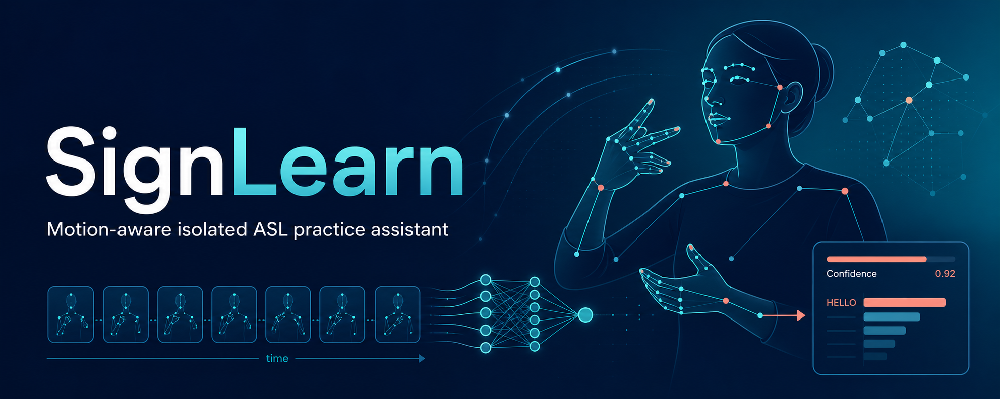
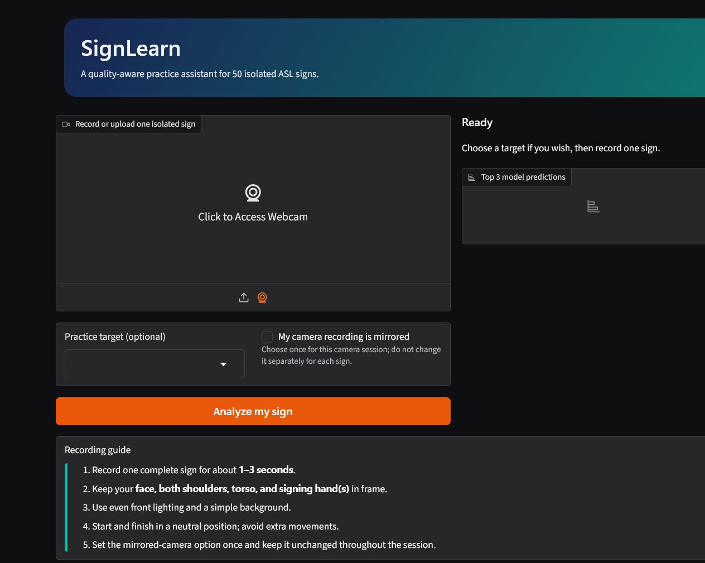
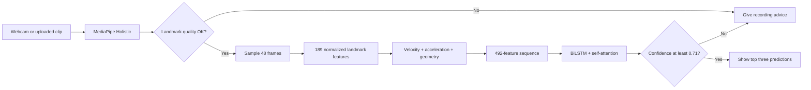

<p align="center">
  
</p>

<h1 align="center">SignLearn</h1>

<p align="center">
  Recognizing 50 isolated ASL signs from short videos with landmarks, motion features, and a
  confidence-aware prediction policy.
</p>

<p align="center">
  
  
  
  
</p>

SignLearn started as my project after completing the Deep Learning Specialization. I wanted to take
the sequence models, regularization, error analysis, and transfer-learning ideas from the courses
and use them in something more complete than a training notebook. The result is a small local web
app backed by a signer-independent evaluation and a reproducible model-selection trail.

This is deliberately a narrow project: it classifies one pre-segmented sign from a fixed 50-label
vocabulary. It does not translate ASL sentences or assess someone's signing ability.

## Demo

<p align="center">
  
</p>

Record with a webcam or upload an MP4/WebM clip. The app first checks whether MediaPipe can see
enough of the hands, face, and shoulders. If the clip passes that check, the model returns its top
three predictions. Predictions below the operational confidence threshold are withheld and shown
as a retry instead.

## Results

The current model uses 492 features per frame. I selected its checkpoint by validation macro F1,
then compared it with the previous 189-feature model on the same frozen, signer-disjoint internal
holdout.

| Metric | Previous model | Current model | Difference |
|---|---:|---:|---:|
| Top-1 accuracy | 71.13% | **71.69%** | +0.56 pp |
| Macro F1 | 71.04% | **71.60%** | +0.56 pp |
| Mirrored macro F1 | 69.88% | **70.98%** | +1.10 pp |
| Top-5 accuracy | **90.03%** | 89.69% | -0.34 pp |
| Accepted accuracy at the selected threshold | 83.68% | **84.03%** | +0.35 pp |
| Coverage at the selected threshold | 77.43% | **77.50%** | +0.07 pp |

The top-5 regression is included because the new model did not improve every metric. At its 0.60
validation-selected threshold, the current model covered 77.50% of the internal holdout with 84.03%
accuracy on accepted clips. The web app uses a stricter provisional threshold of 0.71 until it can
be calibrated on a separate webcam dataset.

These are internal comparison results, not evidence of real-world ASL accessibility performance.
The Google holdout had appeared in earlier project reports, and WLASL was kept out of development.

## How it works



Each model input has shape `(1, 48, 492)`:

| Feature block | Size | Contents |
|---|---:|---|
| Base | 189 | hand, pose and selected lip landmarks plus detection indicators |
| Velocity | 144 | frame-to-frame change in hands and selected pose points |
| Acceleration | 144 | change in the masked velocity channels |
| Geometry | 15 | distances between hands, face, shoulders and fingertips |

Motion and distance features are set to zero when their source landmarks are missing. That detail
matters: otherwise a failed hand detection can look like a large movement.

The 492-feature network was initialized from the stronger 189-feature model. Existing projection
weights were copied exactly and the rows for new features were initialized to zero. Before
fine-tuning, I checked that both networks produced identical probabilities when the new channels
were zero. The experiment history, including the candidate that failed the first promotion gate,
is kept under [`research/`](research/).

## Run locally

### What you need

- 64-bit Python 3.11
- Git
- a webcam or a short MP4/WebM clip
- internet access on the first run to download the MediaPipe Holistic task file

### Windows

Clone the repository using GitHub's **Code** button, open PowerShell in the cloned directory, then
run:

```powershell
Set-ExecutionPolicy -Scope Process Bypass
.\run_app.ps1
```

The launcher creates its environment under `%LOCALAPPDATA%\SignLearn`. This short path avoids the
Windows long-path error caused by TensorFlow's nested header files.

### Linux or macOS

```bash
chmod +x run_app.sh
./run_app.sh
```

Open <http://127.0.0.1:7860> after the server starts.

### Manual setup

```bash
python3.11 -m venv .venv
# Linux/macOS
source .venv/bin/activate
# Windows PowerShell: .venv\Scripts\Activate.ps1

python -m pip install --upgrade pip
python -m pip install -r requirements.txt
python app.py
```

## Check the installation

The repository contains a data-free evaluation test that verifies the final audit JSON, comparison
CSV, promotion rules, model manifest, selective metrics, and model hash agree with one another:

```bash
python -m unittest tests.test_evaluation_evidence -v
```

To test the complete video pipeline, start the app and upload a recording you own or have permission
to use. See [`sample_videos/README.md`](sample_videos/README.md) for recording guidance and a command
that removes audio and metadata. Third-party dataset recordings are not included.

The fast tests do not import TensorFlow:

```bash
python -m pip install -r requirements-dev.txt
python -m unittest discover -s tests -v
ruff format --check app.py signlearn tests
ruff check app.py signlearn tests
```

They check the feature layout and missing-landmark behavior, metadata consistency, label ordering,
confidence policy, and model SHA-256 hash. The same commands run in GitHub Actions.

## Project structure

```text
app.py                     Gradio interface
signlearn/
  engine.py                model loading and prediction
  preprocessing.py         48 x 492 feature pipeline
  video.py                 video decoding and MediaPipe tracking
models/                    trained model and frozen metadata
sample_videos/             instructions; local recordings are Git-ignored
tests/                     fast contract tests
research/
  notebooks/               mirror, ablation, transfer and audit notebooks
  results/                 frozen model-selection evidence
paper/                     Markdown and LaTeX manuscript sources
docs/assets/               banner and interface screenshot
```

The main supporting documents are:

- [`MODEL_CARD.md`](MODEL_CARD.md) — intended use, metrics and known limitations
- [`DATA_CARD.md`](DATA_CARD.md) — dataset split and provenance notes
- [`REPRODUCIBILITY.md`](REPRODUCIBILITY.md) — experiment order and frozen checks
- [`ETHICS.md`](ETHICS.md) — consent, privacy and claims I intentionally avoid
- [`paper/signlearn_paper.md`](paper/signlearn_paper.md) — full draft paper and references

## Known limitations

- The model recognizes only the 50 labels in [`models/label_map.json`](models/label_map.json).
- It expects one already-segmented sign, not a continuous conversation.
- Landmark tracking can fail with occlusion, fast movement, poor lighting or unusual camera angles.
- Confidence is used as a retry policy; it has not been calibrated on an independent webcam study.
- The available metadata are not sufficient for credible demographic subgroup claims.
- No user study has established learning benefit or accessibility impact.

Do not use this project for interpreting, emergencies, grading, hiring, medical decisions, access
control, or any other consequential decision. Get consent before recording another person.

## Research and citation

The manuscript is available in [Markdown](paper/signlearn_paper.md) and
[LaTeX](paper/signlearn_paper.tex), with a separate [BibTeX file](paper/references.bib). It cites the
dataset and the relevant sign-language recognition, landmark-tracking, temporal-modeling and
selective-prediction literature.

Before publishing a fork, add your identity to `CITATION.cff` and the manuscript. Also complete the
[`GITHUB_PUBLISHING_CHECKLIST.md`](GITHUB_PUBLISHING_CHECKLIST.md).

## License

The source code is available under the [MIT License](LICENSE). The code license does not grant
rights to the Google/Kaggle data, the trained weights, MediaPipe assets, or third-party packages.
Read [`MODEL_LICENSE.md`](MODEL_LICENSE.md) and [`NOTICE`](NOTICE) before redistributing those files.
